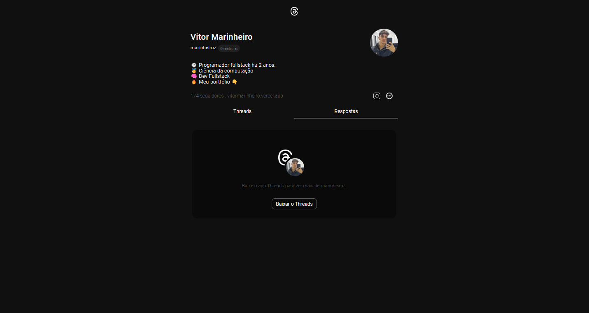

<h1 align="center" style="font-weight: bold;">Threads 💻</h1>

<p align="center">
 <a href="#tech">Technologies</a> • 
 <a href="#started">Getting Started</a> • 
</p>

<p align="center">
    <b>Projeto Simples de Criação de Perfil no Threads</b>
</p>

<p align="center">
     <a href="https://projeto-threads-marinheiroz.vercel.app/">📱 Visit this Project</a>
</p>

<h2 id="layout">🎨 Layout</h2>

<p align="center">
    
    
</p>

<h2 id="technologies">💻 Technologies</h2>

- Reactjs
- Typescript
- Styled Components

<h2 id="started">🚀 Getting started</h2>

Here you describe how to run your project locally

<h3>Prerequisites</h3>

Here you list all prerequisites necessary for running your project. For example:

- [NodeJS](https://github.com/)
- [Git](https://github.com)

<h3>Cloning</h3>

How to clone your project

```bash
git clone https://github.com/vitormarinheiro1/threads.git
```

<h3>Starting</h3>

How to start your project

```bash
cd project-name
npm install
npm start
```

<h3>Documentations that might help</h3>

[📝 How to create a Pull Request](https://www.atlassian.com/br/git/tutorials/making-a-pull-request)

[💾 Commit pattern](https://gist.github.com/joshbuchea/6f47e86d2510bce28f8e7f42ae84c716)
